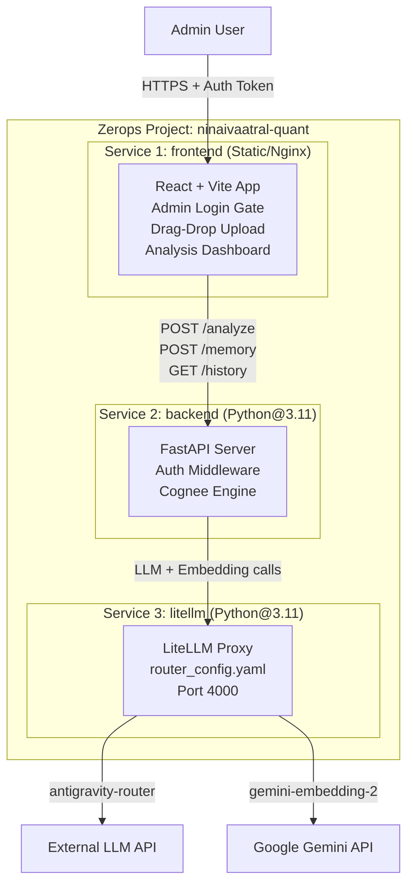
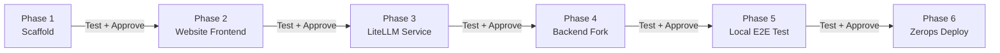
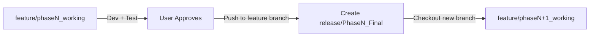
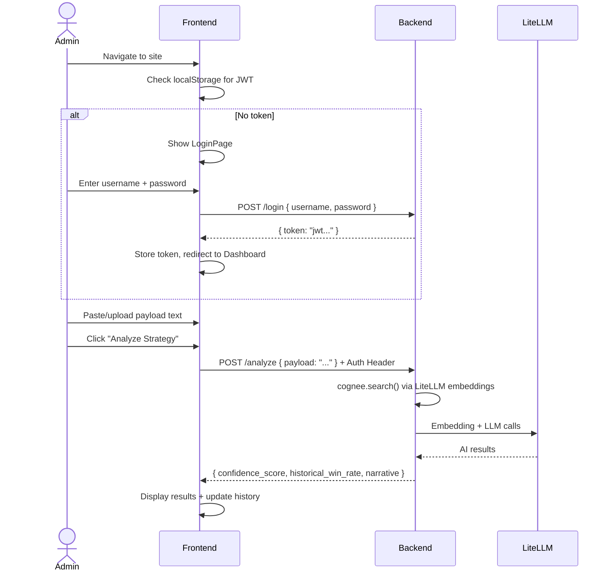

# Ninaivaatral Quant — Web SaaS Implementation Plan (v2)

**Tagline:** "Memory-Powered Trading Intelligence"

## Goal

Transform our private Quantower-only trading analysis engine into a **public, web-based SaaS product** deployed on **Zerops**. Users visit the website, sign in (admin-only), upload any trading strategy payload in their own format, and receive AI-powered analysis results powered by Cognee Knowledge Graph + LiteLLM + Gemini.

---

## Resolved Decisions (Final)

| Question | Decision |
|---|---|
| Branding | **Ninaivaatral Quant** — "Memory-Powered Trading Intelligence" |
| Frontend Tech | **React + Vite** |
| LiteLLM | **3rd Zerops service** (required for LLM + embedding routing) |
| Authentication | **Admin-only sign-in** (no public sign-up, admin credentials via env vars) |
| Payload Format | **Generic/dynamic** — users define their own payload text, not locked to PRE_TRADE/POST_TRADE |
| Progress Tracking | **`hackathon_progress.md`** — separate dedicated file, updated after every phase checkpoint (distinct from any dev task files) |

---

## Architecture (3 Zerops Services)



---

## Development Workflow

> [!IMPORTANT]
> **Phase-Gated Development:** Each phase is a hard checkpoint. After completing a phase, I will present the results for you to **test and approve** before moving to the next phase. Progress is tracked in a separate `hackathon_progress.md` file (NOT the same as any dev task files) that is updated live.



### Git Repository & Branching Strategy

**Repository:** [surendran-QA/Ninaivaatral-Quant](https://github.com/surendran-QA/Ninaivaatral-Quant)

**Branch Naming Convention:**

| Phase | Working Branch | Release Branch (after approval) |
|---|---|---|
| Phase 1 | `feature/phase1_working` | `release/Phase1_Final` |
| Phase 2 | `feature/phase2_working` | `release/Phase2_Final` |
| Phase 3 | `feature/phase3_working` | `release/Phase3_Final` |
| Phase 4 | `feature/phase4_working` | `release/Phase4_Final` |
| Phase 5 | `feature/phase5_working` | `release/Phase5_Final` |
| Phase 6 | `feature/phase6_working` | `release/Phase6_Final` |

**Workflow per Phase:**



1. **Start Phase:** Create `feature/phaseN_working` from the latest release branch (or `main` for Phase 1).
2. **Develop:** All commits go to `feature/phaseN_working`.
3. **Checkpoint:** Present results. User tests and approves.
4. **Finalize:** Push approved code to `feature/phaseN_working`. Create `release/PhaseN_Final` branch from it.
5. **Next Phase:** Create `feature/phaseN+1_working` from `release/PhaseN_Final`.

> [!WARNING]
> Per our strict version control rule: I will NEVER auto-commit or auto-push. I will always ask for your explicit permission before any `git commit` or `git push`.

---

## Phase 1: Project Scaffolding (30 min)

**What:** Create the clean project directory, initialize React+Vite, create all empty placeholder files.

```
c:\Surendran\Fixed volume profile with congee\Zerops_Hackathon\
│
├── zerops.yml
├── .gitignore
├── README.md
│
├── backend/
│   ├── main.py
│   ├── llm_service.py
│   ├── queue_manager.py
│   ├── console_ui.py
│   ├── auth.py                   # NEW: Admin authentication module
│   ├── requirements.txt
│   └── .env.example
│
├── litellm/
│   ├── router_config.yaml
│   └── requirements.txt
│
└── frontend/                     # React + Vite (initialized via npx)
    ├── package.json
    ├── vite.config.js
    ├── index.html
    └── src/
        ├── main.jsx
        ├── App.jsx
        ├── App.css
        ├── index.css
        ├── components/
        │   ├── Header.jsx
        │   ├── LoginPage.jsx       # NEW: Admin sign-in form
        │   ├── PayloadUploader.jsx
        │   ├── AnalysisResult.jsx
        │   ├── HistoryPanel.jsx
        │   └── StatusIndicator.jsx
        └── api/
            └── client.js
```

**Checkpoint:** Directory exists, `npm run dev` starts the Vite dev server, all files created.

---

## Phase 4: Backend Fork & Adaptation (2 hours)

> **Rule: We fork, never modify originals.** The existing `FVP_IB_Cognee_Backend` stays untouched as an immutable baseline.

### File-by-File Changes:

---

#### [NEW] `backend/auth.py` — Admin Authentication Module

Simple token-based admin auth. No user registration. Admin credentials are set via environment variables.

```python
# Pseudocode structure:
# - POST /login: Accepts { username, password }, validates against
#   env vars ADMIN_USERNAME and ADMIN_PASSWORD, returns a JWT token.
# - verify_token(): FastAPI dependency that checks Authorization header.
# - Protected routes (/analyze, /memory, /history) require valid token.
# - /health and /login are public (no auth required).
```

**Environment Variables:**
- `ADMIN_USERNAME` — Admin login username (set via Zerops secrets)
- `ADMIN_PASSWORD` — Admin login password (set via Zerops secrets)
- `JWT_SECRET` — Secret key for JWT signing (set via Zerops secrets)

---

#### [NEW] `backend/main.py`
**Source:** Fork from [main.py](file:///c:/Surendran/Fixed%20volume%20profile%20with%20congee/FVP_IB_Cognee_Backend/main.py)

| Change | Details |
|---|---|
| **REMOVE** Signoz imports | Remove `sys.path.append(Signoz_Hackathon)` and `import telemetry` |
| **ADD** CORS middleware | `allow_origins=["*"]` for cross-origin frontend requests |
| **ADD** Auth dependency | Protected routes use `Depends(verify_token)` from `auth.py` |
| **CHANGE** host binding | `127.0.0.1` → `0.0.0.0` |
| **ADD** `POST /login` | Public endpoint for admin authentication |
| **ADD** `GET /health` | Public endpoint that checks backend status AND pings LiteLLM. Returns `{"backend": "online", "litellm": "online"}` |
| **ADD** `GET /history` | Protected endpoint returning archived analyses as JSON |
| **CHANGE** payload handling | `/analyze` accepts **any** user-defined text, not just PRE_TRADE format |
| **CHANGE** `DATA_ROOT_DIRECTORY` | Default to `./cognee_data` (relative, no hardcoded `C:\`) |

**Kept Identical:**
- Core `/analyze` logic (calls `analyze_setup_payload`)
- Core `/memory` logic (queue-based ingestion)
- L2 Idempotency Bouncer
- M4 Quantitative Math Ledger
- Archive file writing

---

#### [NEW] `backend/llm_service.py`
**Source:** Fork from [llm_service.py](file:///c:/Surendran/Fixed%20volume%20profile%20with%20congee/FVP_IB_Cognee_Backend/llm_service.py)

| Change | Details |
|---|---|
| **REMOVE** all `telemetry.*` calls | 6 occurrences (spans, gauges, histograms, counters) |
| **REMOVE** `sys.path.append` for Signoz | Not needed |
| **ADAPT** search query | Make search query generic — not hardcoded to "Profile Shapes" and "Value Area/POC" terminology. Instead: "Find historical sessions with similar structural patterns to this payload." |
| **ADAPT** LLM system prompt | Broaden from "quantitative trading AI" to handle any user-defined strategy payload format |
| **EXPAND** LLM JSON output | Add 4 new fields to the required JSON response: `suggested_bias` (LONG/SHORT/NEUTRAL), `key_risk` (primary risk factor), `similar_sessions_count` (number of matches), `pattern_notes` (brief pattern description). These are **decision-support insights**, not automated actions. |

**Kept Identical:**
- `process_memory_payload()` — Cognee add + cognify logic
- Token optimization logic
- Error handling / timeout / fallback logic
- OpenAI client pointing to LiteLLM proxy via env vars

---

#### [NEW] `backend/queue_manager.py`
**Source:** Fork from [queue_manager.py](file:///c:/Surendran/Fixed%20volume%20profile%20with%20congee/FVP_IB_Cognee_Backend/queue_manager.py)

| Change | Details |
|---|---|
| **REMOVE** all `telemetry.*` calls | 2 occurrences |
| **REMOVE** `sys.path.append` for Signoz | Not needed |

**Kept Identical:** Everything else (queue loop, pacing, file handling).

---

#### [NEW] `backend/console_ui.py`
**Source:** Direct copy. No changes.

---

#### [NEW] `backend/requirements.txt`
```
fastapi
uvicorn[standard]
cognee
python-dotenv
openai
pyjwt
```
Removed: All `opentelemetry-*` and Signoz packages.
Added: `pyjwt` for admin auth tokens.

---

#### [NEW] `backend/.env.example`
```env
# Admin Auth (set real values in Zerops Secrets)
ADMIN_USERNAME=admin
ADMIN_PASSWORD=changeme
JWT_SECRET=your-random-secret-key

# LLM Routing (via LiteLLM proxy)
OPENAI_API_KEY=sk-1234
OPENAI_BASE_URL=http://litellm:4000
LLM_PROVIDER=openai

# Embeddings (via LiteLLM proxy)
EMBEDDING_PROVIDER=openai
EMBEDDING_MODEL=openai/text-embedding-3-small
EMBEDDING_ENDPOINT=http://litellm:4000
EMBEDDING_API_KEY=sk-1234

# Cognee
COGNEE_SKIP_CONNECTION_TEST=true
DATA_ROOT_DIRECTORY=./cognee_data
SYSTEM_ROOT_DIRECTORY=./cognee_system
OPTIMIZE_TOKENS=True
```

**Checkpoint:** Backend starts locally, `GET /health` returns 200, `POST /login` returns a JWT, `POST /analyze` with token returns AI results.

---

## Phase 3: LiteLLM Service (30 min)

#### [NEW] `litellm/router_config.yaml`

```yaml
model_list:
  - model_name: antigravity-router
    litellm_params:
      model: openai/agnes-2.0-flash
      api_base: https://router.bynara.id/v1
      api_key: os.environ/MISTRAL_API_KEY
  - model_name: text-embedding-3-small
    litellm_params:
      model: gemini/gemini-embedding-2
      api_key: os.environ/GEMINI_API_KEY
      rpm: 90
```

#### [NEW] `litellm/requirements.txt`
```
litellm[proxy]
```

**Checkpoint:** LiteLLM starts locally on port 4000, embedding test call succeeds.

---

## Phase 2: Website Frontend — React + Vite (4 hours)

### Design System

| Token | Value |
|---|---|
| Background | Linear gradient `#0a0a1a` → `#1a1a3e` |
| Card Surface | `rgba(255, 255, 255, 0.05)` + `backdrop-filter: blur(16px)` |
| Primary Accent | `#6C63FF` (Electric Indigo) |
| Success | `#00E676` (Neon Green) |
| Error | `#FF5252` (Coral Red) |
| Warning | `#FFD740` (Amber) |
| Font | `Inter` (Google Fonts) |
| Border Radius | `16px` cards, `12px` buttons, `8px` inputs |
| Card Border | `1px solid rgba(255, 255, 255, 0.1)` |

### Pages

---

#### Page 1: Login Page (`LoginPage.jsx`)

```
┌─────────────────────────────────────────┐
│                                         │
│          NINAIVAATRAL QUANT             │
│    Memory-Powered Trading Intelligence  │
│                                         │
│    ┌─────────────────────────────┐      │
│    │  Username                   │      │
│    └─────────────────────────────┘      │
│    ┌─────────────────────────────┐      │
│    │  Password                   │      │
│    └─────────────────────────────┘      │
│                                         │
│    [ ====== Sign In ====== ]            │
│                                         │
│    "Admin access only"                  │
│                                         │
└─────────────────────────────────────────┘
```

- Glassmorphism login card, centered on dark gradient background.
- Calls `POST /login` → receives JWT → stores in `localStorage`.
- On success → redirects to Dashboard.
- No "Sign Up" link or button anywhere.

---

#### Page 2: Dashboard (Main App — `App.jsx`)

Two-column layout after login:

```
┌─────────────────────────────────────────────────────────┐
│  [Logo] NINAIVAATRAL QUANT              [●] Online  [↩] │
├─────────────────────────┬───────────────────────────────┤
│                         │                               │
│   UPLOAD PAYLOAD        │   ANALYSIS RESULTS            │
│                         │                               │
│   [File Upload] [Paste] │   Confidence:  ██████ 78     │
│                         │   Win Rate:    65%             │
│   ┌───────────────────┐ │                               │
│   │                   │ │   AI Narrative:               │
│   │  Drop .json/.txt  │ │   "Based on 12 historical    │
│   │  here or click    │ │    sessions with similar      │
│   │  to browse        │ │    patterns, 65% resulted     │
│   │                   │ │    in positive outcomes..."   │
│   └───────────────────┘ │                               │
│                         │   Response: 1.2s | Success    │
│   [ Analyze Strategy ]  │                               │
│                         │                               │
├─────────────────────────┴───────────────────────────────┤
│  HISTORY                                                │
│  Timestamp          | Confidence | Win Rate | Status    │
│  2026-08-08 10:05   | 78         | 65%      | Success   │
│  2026-08-08 09:30   | 42         | 38%      | Success   │
└─────────────────────────────────────────────────────────┘
```

- Header: Logo, product name, dynamic API/LLM status indicators (green/yellow/red), logout button `[↩]`
- Left: `PayloadUploader` — toggle between drag-drop and paste modes
- Right: `AnalysisResult` — glassmorphism card with animated gauge + AI insights
- Bottom: `HistoryPanel` — table of past analyses

---

### `AnalysisResult` Component Detail

**States:** `idle` (empty prompt) → `loading` (pulsing skeleton) → `success` (full results) → `error` (red card)

**Success Layout (expanded with AI Insights):**

```
┌──────────────────────────────────────────────┐
│  CONFIDENCE SCORE           WIN RATE         │
│     ┌────┐                  ┌────┐           │
│     │ 78 │                  │65% │           │
│     └────┘                  └────┘           │
│  (radial gauge)          (percentage)        │
│                                              │
│  AI INSIGHTS (Decision Support)              │
│  ┌────────────────────────────────────────┐  │
│  │ Suggested Bias:   LONG                │  │
│  │ Key Risk:         SL cluster @29200   │  │
│  │ Similar Sessions: 12 found            │  │
│  │ Pattern Notes:    b-Shape + high vol  │  │
│  └────────────────────────────────────────┘  │
│                                              │
│  AI NARRATIVE                                │
│  "Based on 12 historical sessions with       │
│   similar b-Shape profiles, 65% resulted     │
│   in TP Hit. Consider LONG bias but watch    │
│   the SL cluster at 29200..."                │
│                                              │
│  * AI suggestions are for reference only.    │
│    Final trading decisions are yours.        │
│                                              │
│  Status: Success  |  1.2s  |  12 matches     │
└──────────────────────────────────────────────┘
```

- **Confidence Score:** Animated radial gauge (SVG circle). Green (>70), Yellow (40-70), Red (<40).
- **Win Rate:** Large bold percentage text.
- **AI Insights Panel:** Compact sub-card with `suggested_bias`, `key_risk`, `similar_sessions_count`, `pattern_notes`.
- **Narrative:** AI-generated explanation in a quote block.
- **Disclaimer:** Small italic text: *"AI suggestions are for reference only. Final trading decisions are yours."*

---

### Dynamic Payload Format

> [!IMPORTANT]
> The payload is **user-defined free text**. Users can paste ANY trading strategy description — not just our Quantower PRE_TRADE/POST_TRADE format. The backend treats it as raw text for Cognee ingestion and LLM analysis.

**Example payloads the system should accept:**

```
User Payload 1 (our Quantower format):
"[SESSION ID: NQ_2026-07-05]
Profile Shape: bShape
Value Area: VAH 29800 | POC 29500 | VAL 29200
System Bias: LONG"

User Payload 2 (some other trader's format):
"Strategy: Mean Reversion on SPY
Entry: 445.20 | Stop: 443.80 | Target: 447.50
RSI: 28 (oversold) | VWAP: Below
Timeframe: 15min"

User Payload 3 (completely freeform):
"Today I noticed a double bottom forming on AAPL at the 
$182 support level. Volume was 2x average. My strategy 
says to enter long with a tight stop at $180."
```

The `PayloadUploader` textarea placeholder will show a brief hint: *"Paste your strategy analysis, trade setup, or any trading payload here..."*

### Example Payload Templates (Clickable Pre-fills)

The UI will include a row of **"Try an Example"** buttons above the textarea. Clicking one pre-fills the textarea with that template so users can see the expected format and test instantly.

| Template Name | Button Label | Pre-fill Content |
|---|---|---|
| Volume Profile Setup | "Volume Profile" | `[SESSION ID: DEMO_001]`<br>`Strategy: FVP_IB_Strategy`<br>`Profile Shape: bShape`<br>`Value Area: VAH 29800 \| POC 29500 \| VAL 29200`<br>`System Bias: LONG`<br>`IB Range: High 30000 \| Low 29000` |
| Mean Reversion | "Mean Reversion" | `Strategy: Mean Reversion on SPY`<br>`Entry: 445.20 \| Stop: 443.80 \| Target: 447.50`<br>`RSI: 28 (oversold) \| VWAP: Below`<br>`Timeframe: 15min` |
| Freeform Notes | "Freeform" | `Today I noticed a double bottom forming on AAPL at`<br>`the $182 support level. Volume was 2x average.`<br>`My strategy says to enter long with a tight stop at $180.` |
| Post-Trade Outcome | "Trade Result" | `[SESSION ID: DEMO_001]`<br>`Strategy: FVP_IB_Strategy`<br>`Result: TP Hit`<br>`Exit Reason: Target Reached`<br>`Net PnL: +50.0`<br>`Notes: Clean breakout above POC with high volume.` |

These templates serve three purposes:
1. **Demo for judges:** One-click to see the full analysis flow working
2. **Onboarding:** New users understand what kind of data to paste
3. **Testing:** Quick way to verify the backend is responsive

---

### User Flow (with Auth)



---

### Component API Integration (`api/client.js`)

| Method | Endpoint | Auth | Purpose |
|---|---|---|---|
| `POST` | `/login` | No | Admin sign-in, returns JWT |
| `GET` | `/health` | No | Backend health check |
| `POST` | `/analyze` | Yes (JWT) | Send payload, get AI analysis |
| `POST` | `/memory` | Yes (JWT) | Store trade outcome in knowledge graph |
| `GET` | `/history` | Yes (JWT) | Fetch past archived analyses |

All authenticated requests include `Authorization: Bearer <jwt_token>` header.

---

## Phase 5: Local End-to-End Test (1 hour)

1. Start LiteLLM on port 4000
2. Start Backend on port 8000
3. Start Frontend on port 5173
4. Test: Login → Upload payload → See results → Check history
5. Test: Wrong credentials → Login rejected
6. Test: Expired/invalid token → Redirected to login

**Checkpoint:** Full flow works locally with real Gemini API calls.

---

## Phase 6: Zerops Deployment (2 hours)

#### [NEW] `zerops.yml`

```yaml
zerops:
  # Service 1: LiteLLM Proxy
  - setup: litellm
    build:
      base: python@3.11
      buildCommands:
        - cd litellm && pip install -r requirements.txt
      deployFiles: litellm/~
    run:
      base: python@3.11
      ports:
        - port: 4000
          httpSupport: true
      start: python -m litellm --config router_config.yaml --host 0.0.0.0 --port 4000
      envVariables:
        GEMINI_API_KEY: ${GEMINI_API_KEY}
        MISTRAL_API_KEY: ${MISTRAL_API_KEY}

  # Service 2: FastAPI Backend
  - setup: backend
    build:
      base: python@3.11
      buildCommands:
        - cd backend && pip install -r requirements.txt
      deployFiles: backend/~
    run:
      base: python@3.11
      ports:
        - port: 8000
          httpSupport: true
      start: python -m uvicorn main:app --host 0.0.0.0 --port 8000
      readinessCheck:
        httpGet:
          port: 8000
          path: /health
      envVariables:
        OPENAI_API_KEY: sk-1234
        OPENAI_BASE_URL: http://litellm:4000
        EMBEDDING_PROVIDER: openai
        EMBEDDING_MODEL: openai/text-embedding-3-small
        EMBEDDING_ENDPOINT: http://litellm:4000
        EMBEDDING_API_KEY: sk-1234
        COGNEE_SKIP_CONNECTION_TEST: "true"
        OPTIMIZE_TOKENS: "True"
        LLM_PROVIDER: openai
        ADMIN_USERNAME: ${ADMIN_USERNAME}
        ADMIN_PASSWORD: ${ADMIN_PASSWORD}
        JWT_SECRET: ${JWT_SECRET}

  # Service 3: React Frontend (Static)
  - setup: frontend
    build:
      base: nodejs@20
      buildCommands:
        - cd frontend && npm ci && npm run build
      deployFiles: frontend/dist/~
    run:
      base: static
```

**Zerops Secret Variables (GUI only, never in code):**
- `GEMINI_API_KEY`, `MISTRAL_API_KEY`
- `ADMIN_USERNAME`, `ADMIN_PASSWORD`, `JWT_SECRET`

**Checkpoint:** Public `.zerops.app` URL works end-to-end.

---

## Summary: What We Build vs What We Reuse

| Component | Action | Source |
|---|---|---|
| `backend/main.py` | **Fork + Modify** | CORS, auth, health, history, generic payloads, `0.0.0.0` |
| `backend/llm_service.py` | **Fork + Modify** | Remove Signoz, broaden search/prompt for generic payloads |
| `litellm/router_config.yaml` | **Fork + Modify** | Add explicit embedding api_key |
| `frontend/*` | **Brand New** | React + Vite, login page + dashboard |
| `zerops.yml` | **Brand New** | 3-service deployment manifest |
